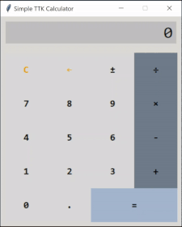

# 🐍 Python Etudes 🎹

This repository holds a bunch of simple Python projects serving both as an exercise and a demo of a particular concept or a technology.

Each project has a dedicated subfolder and is intended to work standalone. Please make sure to the read instructions as the installation and running process may differ from project to project.

## Common Requirements 📌

- All projects have been written for Python 3.12 or later
- All projects should be run in their own dedicated [virtual environment](https://docs.python.org/3/library/venv.html)
- Depending on how they are going to be used, all projects may require local [editable installation](https://setuptools.pypa.io/en/latest/userguide/development_mode.html) via `pip`
- Some projects may require installation of their dependencies (specified in `pyproject.toml`) via `pip`

## Projects 🔭

### [TTK Calculator](./ttkcalculator/)

Demo of the [MVC](https://en.wikipedia.org/wiki/Model–view–controller) / [MVP](https://en.wikipedia.org/wiki/Model–view–presenter) architectural pattern in conjunction with TKInter.

### [AST Calculator](./astcalculator/)

Showcase of Python's [ast package](https://docs.python.org/3/library/ast.html) used to build a mathematical expression interpreter.

### [Unit Converter](./webconverter)

Exploration of [NiceGUI](https://nicegui.io/) capabilities by implementing an unit converter app.

## License

[MIT License](LICENSE)
