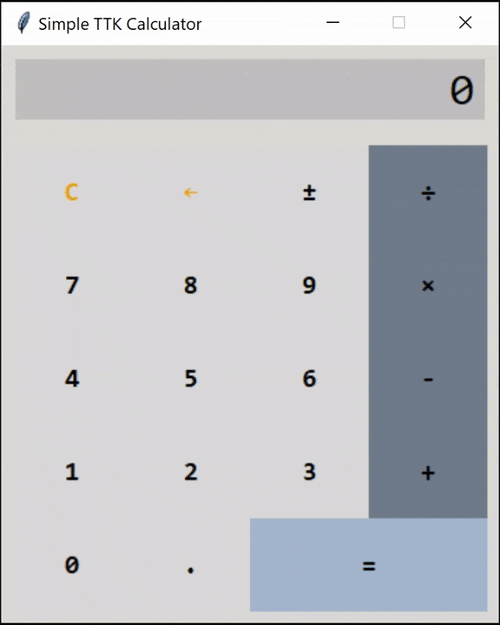

# Simple TTK Calculator

The purpose of this project is purely educational. It aims to show, how
to separate the business logic from the presentation layer using a variation
of the [Model-View-Controller pattern](https://en.wikipedia.org/wiki/Model–view–controller),
in this case with Python and TKInter. Anyone with an interest should feel
free to use it as a basis for their own experiments.

## User Documentation

The TTK Calculator app itself is rather plain and straightforward implementation
of a simple desk calculator.



It's been tested on recent (as of October 2024) versions of 
[Windows](./docs/ttk_calculator_win.png), [macOS](./docs/ttk_calculator_mac.png)
and [Ubuntu](./docs/ttk_calculator_lin.png). For more information about the system requirements, please
see the [Installation](#installation) chapter.

### Features

- Support of integers and decimals with a precision of up to 15 digits
- Addition (`+`), subtraction (`-`), multiplication (`×`) and division (`÷`)
  of two numbers
- Short evaluation (e.g. a sequence of button presses consisting of 
  `9` `×` `=` will be translated to `9` `×` `9` `=`)
- Result of a calculation can be automatically used as the first operand
  of the next calculation (e.g. key sequence `9` `×` `9` `=` `+` `9` `=` 
  will yield `90`)
- Inversion of a sign of the currently displayed number (`±`)
- Correction / removal of last digit of the currently displayed number (`←`)
- Reset of the calculator (e.g. after an error) is done via (`C`) button

### User Interaction

Calculator can be operated by a mouse (left-click on the desired calculator
button) or through a keyboard (see the [user manual](docs/manual.md#key-bindings)
for a complete list of key bindings).

## Installation

Make sure you have [Python 3.12 or newer](https://www.python.org/downloads/) 
installed on your system. Please note that the commands in the next chapters 
use `python` but your system may require you to type `python3` instead. 

Moreover, some Python installations (e.g. on Ubuntu or on macOS if installed trough
homebrew) by default do not contain TKInter Python package (usually called `python3-tk`
or `python-tk`). You may need to use your package manager to check and possibly install
the missing package (e.g. `sudo apt install python3-tk` on Ubuntu or 
`brew install python-tk` on macOS).

### For Users

- Choose your **installation folder** and open it in a terminal emulator
(a.k.a. command line) running **cmd**, **powershell**, **bash**, **zsh** or other
**sh**-like shell.
- Clone the GitHub repository
    ```shell
    git clone https://github.com/slacker-by-design/python_etudes
    ```
    If you don't have [git](https://git-scm.com/) installed, go back to the 
    [python_etudes](https://github.com/slacker-by-design/python_etudes) 
    GitHub repository page and download it as a 
    [zip](https://github.com/slacker-by-design/python_etudes/archive/refs/heads/main.zip)
    archive file. Then extract its contents to an installation folder of your choice.
- Run the calculator
    ```shell
    cd python_etudes/ttkcalculator
    python -m ttkcalculator
    ```

### For Developers

- Choose your **installation folder** and clone the
  [GitHub repository](https://github.com/slacker-by-design/python_etudes) into it
- Create a Python virtual environment
    ```shell
    cd ttkcalculator
    python -m venv venv
    ```
- Activate the virtual environment
    - Linux & macOS
      ```shell
      source venv/bin/activate    
      ```
    - Windows Powershell
      ```shell
      .\venv\Scripts\Activate.ps1
      ```
    - Windows CMD
        ```shell
        venv\scripts\activate.bat
        ```
- Install the `ttkcalculator` package as editable
    ```shell
    python -m pip install -e .
    ```

#### Running Tests

- Make sure the `pytest` package is installed in your virtual environment
    The command
    ```shell
    python -m pip list
    ```
    should show a list of installed packages including `ttkcalculator` and `pytest`.
    In case `pytest` is missing, install it by typing
    ```shell
    python -m pip install ".[test]"
    ```
- Run the tests
    ```shell
    python -m pytest
    ```

## Additional Information

Here's few more bits and pieces, which may be useful...

- You may want to check the [TTK Calculator user manual](docs/manual.md)
- The [technical documentation](docs/technical_specs.md) contains a brief
  explanation of how the Model-View-Controller has been adopted in the
  case of TTK Calculator.

## License

[MIT License](../LICENSE)
