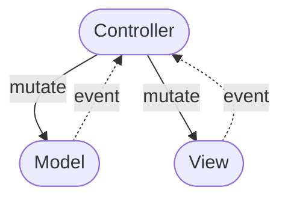
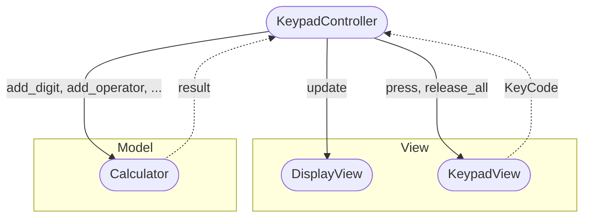

# Architecture Overview

The purpose of the **TTK Calculator** project is purely educational. The goal was
to demonstrate, how to separate the business logic from the presentation layer using
a commonly recognized SW architecture pattern called 
[Model-View-Controller](https://en.wikipedia.org/wiki/Model%E2%80%93view%E2%80%93controller)
(will be referred to as MVC further on in this document).

> ## ⚠️Disclaimer⚠️
> 
> The MVC is rather old concept and as such has been re-hashed quite a few times.
> There are many variations and derived distinct patterns such as Model-View-Adapter,
> Model-View-Presenter or Model-View-Viewmodel to name few well known ones.
> 
> The variation used in this case slightly differs from the original MVC!

## What is MVC
MVC is an architectural pattern used to separate program code of a GUI application into 
distinct layers (this is also called separation of concerns).

### Model

- Maintains the application state
- Implements state-changing behaviour
- Can send change events to the controller

### View

- Handles output and low-level input
- It's also responsible for sending high-level events to the controller

### Controller

- Mediates between model and view
- It does this by listening to the events from model and view
- Mutates the model and view accordingly

## Implementation Overview

The TTK Calculator's view is stored in the [view module](../ttkcalculator/view.py) consists 
of `DisplayView` and `KeypadView` protocols (interfaces) and their concrete implementations
(`TkDisplayView`, `TkKeypadView`).

The model is implemented by the `Calculator` class located in the [model module](../ttkcalculator/model.py).

Last but not least, the `KeypadController` class is the sole controller. It can be found in the
[controller module](../ttkcalculator/controller.py).

Please note that the [view module](../ttkcalculator/view.py) also contains couple of classes which
use TKInter widgets to implement the actual calculator GUI, but these are not significant from the 
architectural point of view.

Last module of the `ttkcalculator` package, [app](../ttkcalculator/app.py), contains code which wires all 
the components together and provides the application entry point.
